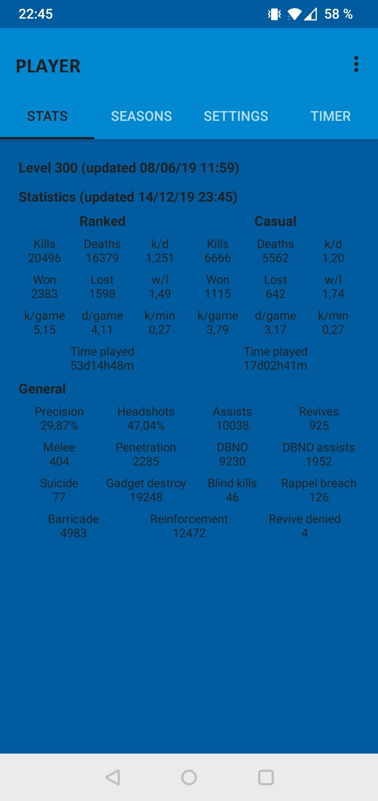

# What is/was it ?

Designed for Rainbow Six Siege, it was an Android app to check anyboby's stats and track their game results.

**This app isn't maintained anymore** (last supported season was Shifting Tides - march 10, 2020), many websites like https://r6.tracker.network/ does the job very well !

The support was limited to :
- Platform : PS4
- Regions : EMEA & NCSA

# Features

- See current rank of everybody you follow
- Get detailed stats of anyone :
  - General data & statistics
  - Current season data
  - Last 10 games history
  - Past seasons data
- Instant refresh of everything above
- Periodic refresh of everything above (exept past seasons)
  - Notifications pops if there's anything new

# Screenshots

  
*Connection : a Ubisoft account is required / Home : list of followed players*

 
*Add player : insert name and choose which stats to update*

 
*General stats*

 
*Seasonal stats : current season, last 10 games, past seasons*

  
*Settings : refresh stats manually, delete the player*

  
*Periodic refresh (set 00:00 to disable)*

 
*Notifications (periodic refresh enabled)*

# License

See the [GNU General Public License v3.0](LICENSE.txt) file for license rights and limitations.